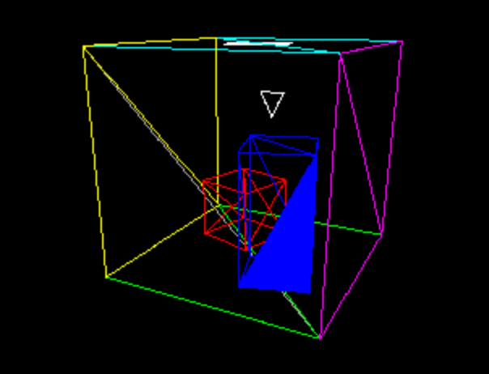
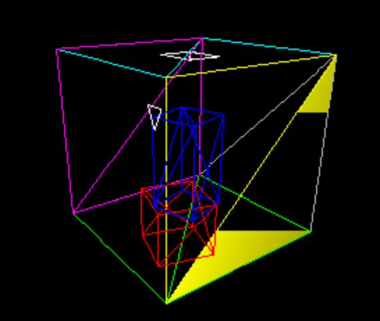
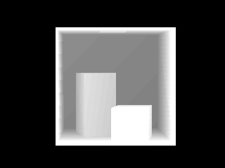

# Computer Graphics (COMS30020)

### Debugging Tips
Implementing the workbook exercises for this unit is far from easy ! The application is a challenging conceptual task,
requiring a complex multi-stage rendering. Even though the practical supervisors are familiar with exercises
and algorithms being used, it can often take a **LOT** of time and effort to diagnose and help fix problems
with a particular person's implementation (code can often be a "work in progress" and people frequently
do things in unusual ways !!!)

The aim of this document is to give you some self-help hints and tips about solving problems you might encounter.
It is impractical to rely upon the ad-hoc trial-and-error approaches to debugging that we might have used in the past.
You should be starting to develop some more systematic and methodical diagnostic and debugging strategies !  

### Difficulty of Debugging
A factor that makes the workbook tasks especially hard is the large amount of data that needs to be manipulated
(many triangles, many vertices, many pixels and many loop iterations). This has practical implications for debugging -
it is often not possible to gain insight into the operation of the code by just doing a few `cout` or `printf` commands
(there are often too many numbers and the output scrolls by too quickly).  

It goes without saying that using a proper debugging tool will help you greatly.
There is a learning overhead in getting to grips with such tools, but they will save you a lot of time in the long run !
They will let you pause execution halfway through a render and explore the content of variables.
Even if you are using a purpose-built debugger, the complex spacial nature of the data will still cause you problems.
The following sections provide some ideas for alternative strategies...  

### Suitable Test Data
Selecting suitable data to test your renderer can make your job a whole lot easier. Unit testing of individual functions
with sample data (remember Test-Driven Development from the 2nd year ?) allows you to check that individual functions
are operating correctly. For example you can verify correct operation of an interpolation function by passing in
data with known results.  

In terms of integration testing, it's often best not to run the renderer on a complex model to diagnose problems.
It is usually easier to see what is going on with a cut-down version of the 3D model (e.g. a model containing only
1 or 2 simple triangles for example). The diagram below show the Cornell box test file, but with just a single blue
triangle being fully rasterised (the remain elements being draw as just a simple wireframe to provide context):  

.

It is a lot easier to visually make sense of such output (especially if the rendered image is mixed up and confusing).
Equally, printing out the vertex coordinates of 1 or 2 triangles is going to be easier to read than the whole model !

It is easy enough to alter the main triangle-drawing loop in your code to cover only a subset of the model triangles.  
You could even make your application interactive, using keyboard input to select which triangle to render
(e.g. tabbing to cycle through the set of triangles to select which one is to be rendered).

### Incremental Rendering

In some situations it is useful to slow down rendering (so you can see the order in which things are being done).
For example, you could add a counter which limits the number of rake lines that are rendered for each triangle.
By slowly increasing this counter (i.e. making it one bigger each time the `draw` function is called) it is
possible to create a slowed-down animated render - allowing you to see line-by-line rasterising of triangles.
For example, the image below shows the renderer part way through rendering the top yellow triangle
(the bottom yellow triangle is already complete !)

.

### "Visual" Debugging
This approach involves encoding numerical data as visual attributes of the rendered image. In particular,
you can use pixel colour to visually present key attributes of a model. For example, the following render ignores
the colour of the surfaces, but instead sets the colour of each pixel based on the calculated distance from
the camera to each point in the model:  

.

If there is something wrong with your calculation, you will easily be able to see it in the render
(rather that having to make sense of a load of numbers scrolling past in the terminal window !)

### Refactor and Rewrite
As practical supervisors, we are often ask to help fix problems with "less than perfect" code.
Try to make our job easier by keeping everything neat and tidy - not only will this help us,
but it will improve your understanding of your own code.

Be sure to make good use of informative variable names...  
It can be frustrating for us when trying to help if the variables are called 'a' 'b' 'c'.
Remember that there is mathematics and there is programming - and this is programming !  

Over time code evolves into a messy spaghetti-like mess that can be hard to understand and work with.
It is good practice to periodically refactor (or even totally rewrite from scratch) your code.

This may seem like you are throwing away all your good work...  
However it is often a good investment to spend some time untangling, rationalising and simplifying your codebase.
Even if you start again with a blank file, you are not throwing away the knowledge and understanding
that you have already gained from your previous (messy and ugly) attempt. The next time around you will
be able to build it quicker AND more elegantly (maybe).
