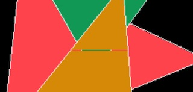

## Triangles and Textures
### <a href="https://www.ole.bris.ac.uk/webapps/blackboard/content/launchLink.jsp?course_id=_260093_1&tool_id=_5824_1&tool_type=TOOL&mode=cpview&mode=reset" target="_blank"> Weekly Briefing  </a>
### Task 1: Introduction

As usual, make sure you have seen the weekly briefing above before attempting to complete this week's workbook tasks. Note that you will will need to be <a href="https://www.ole.bris.ac.uk/auth-saml/saml/login?apId=_183_1&amp;redirectUrl=https%3A%2F%2Fwww.ole.bris.ac.uk" target="_blank">logged into Blackboard</a> already in order for the link to the weekly briefing video to work (because, you know - Blackboard).

Although we are still working primarily in 2 dimensions, the aim of this week's workbook is to build up a collection of useful drawing functions that can be used later on in the unit. Much of the later work in future workbooks will be in 3D. However, as we shall soon see, we will still need to do a lot of 2D drawing (strange but true). After all, screens/displays are by their very nature two dimensional !

**Important:** Make sure you read the "Hints and Tips" at the end of each section before attempting that task. This might save you a lot of time and anguish !  

# 
### Task 2: Line Drawing
  

We start this week by writing one of the core building blocks of any graphics framework - a function to draw straight lines. Although this might seem simple and almost trivial, there are some technical implementation issues that prove an interesting challenge !

View the slides and audio narration linked to above and then, using the knowledge you have gained, add a function to your code to draw a simple line in the SDL window. Your function should accept as parameters a `from` point and a `to` point. A `CanvasPoint` class has been provided in the `libs/sdw` folder to help you. Add `#include <CanvasPoint.h>` to the "includes" section of your code in order to import this class. The class is used to represent a particular point on the drawing window (what is often called the drawing "canvas"). If you open the `CanvasPoint` class you will see that it contains the x and y coordinates of the point, as well as a number of other attributes. You can just ignore these additional attributes for the time being - we will use them in subsequent workbooks.

You should also allow a colour to be passed into your function so that a line of a particular colour can be drawn. A `Colour` class has also been provided for you in the `libs/sdw` folder - this class contains values for red, green and blue channels as well as an optional name for the colour (don't worry about naming your colours for this workbook - we will use colour names in a later exercise). Add `#include <Colour.h>` to your code in order to import this class.

Test your code by drawing some lines to and from some easily verifiable positions (i.e. lines we can easily see have been drawn correctly). For example, you might like to try the following:
- A line from the top-left corner of the window to the centre of the window
- A line from the top-right corner of the window to the centre of the window
- A vertical line all the way down the middle of the screen
- A horizontal line a third the width of the screen, centred both horizontally and vertically  

**Hints & Tips:**  
Use the knowledge of interpolation you gained from last week's workbook (and the functions you wrote) to help you construct your line drawing function.

Note that the `CanvasPoint` and `Colour` classes both override the `<<` operator, so you can direct them straight to `cout` for debugging purposes !  

# 
### Task 3: Stroked Triangles

Now let's make our drawing functions a bit more sophisticated by drawing a more complex shape - a triangle ! Triangles are going to form the basic building block for the rest of this unit - they are incredibly powerful and we can achieve much using them.

Add a new function to your code that draws "stroked" (unfilled) triangles. This function should draw the three outer edge lines of a triangle that is passed in as parameters. A `CanvasTriangle` class has been provided in the `libs/sdw` folder to help you. This class represents a 2D triangle for drawing onto the screen/canvas. This class contains an array of three `CanvasPoints` that are used to store the vertices of the triangle. Add `#include <CanvasTriangle.h>` to your code in order to import this class.

In order to make your code more versatile, add an additional parameter to your triangle drawing function that allows a colour to be passed in (so that triangles of different colours can be drawn). You should use the same `Colour` class that was introduced in the previous task to represent the colour of the triangle.

In order to make your application interactive, add to the event handling function of your main class so that when the `u` key is pressed, your triangle drawing function is called. The parameters passed to your function should be a `CanvasTriangle` of 3 randomly generated vertices and a randomly generated colour.

Test out your code by pressing the `u` key (lots of times !!!).  
You should end up with a screen that looks something like the one below.  

**Hints & Tips:**  
A sensible way to approach the challenge of drawing a triangle is to make use of your previously implemented line drawing function (to draw the three sides of the triangle).

In completing this task, you might like to use the standard C <a href="http://www.cplusplus.com/reference/cstdlib/rand/" target="_blank">rand</a> function to help. This function returns a random integer between 0 and 32767 (depending on platform !). In order to bring this integer into a desired range, we can use the modulus operator `%`. For example `rand()%256` will give us a random number in the range 0-255.

Note that the `CanvasTriangle` class overrides the `<<` operator so that you can direct instances of this class straight to `cout` for debugging purposes.  

# 
### Task 4: Filled Triangles
     

Drawing filled triangles is more difficult than you might think ! Take a look at the media linked to by the buttons above (you will notice that there are a number of them - reflecting the complexity of this task). Note that you do NOT need to implement the interactive features demonstrated in the above animations - these are just for illustration purposes. You should however write a new function that takes a `CanvasTriangle` and a `Colour` as parameters and draws a suitable _filled_ triangle. 

As well as drawing a _filled_ triangle of the specified colour, your function should also draw a **white** _stroked_ triangle over the top of it (this is to make sure that your "rasterising" is correct - both filled and stroked triangles should line up !)  

Make your application interactive, so that pressing the `f` key will cause a randomly coloured filled triangle to be drawn at a random position on the screen. You should end up with a screen that looks something like the one below.
  

**Hints & Tips:**  
When testing your filled triangle drawing code, watch out for "skipped" lines (as illustrated in the orange triangle below). These skipped lines are due to floating point values being truncated ("chopped off") when they are converted into integer pixel row numbers. When converting from floats to ints you should be sure apply a suitable rounding function. Note that you may have to use different rounding strategies, depending on what _kind_ of integer position you are calculating (e.g. row number, x start position, x end position etc). The best advice we can give here is to _try_ something and see if it _looks_ OK (if it doesn't, then try an alternative !). The ethos of this unit is very much about learning through "experimentation and exploration" !

Just in case you need it: you might like to use the standard C <a href="http://www.cplusplus.com/reference/utility/swap/" target="_blank">std::swap</a> function if you need to do any sorting ;o)  

# 
### Task 5: Texture Mapping
    

In this next exercise, rather than filling a triangle with just a _single_ colour, you will load in a "texture map" of pixels from a file and use these to "colour" the triangle. View the slides, audio narration and animations above to gain an understanding of how to do this. Again, the interactive features (i.e. dragging points around the screen) do NOT need to be implemented - these are just for demonstration purposes in the animations. All you need to do is to write a function that will draw a textured triangle when provided with a suitable texture map.

To help you in this task, a `TextureMap` class has been provided for you in the `libs/sdw` folder. This class has a constructor that takes the filename of a PPM image as a parameter and will load the pixel data in from that file for you. A sample <a href="texture.ppm">PPM texture map</a> has been provided for you to use in this task. We recommend that you use this texture map (rather than any other PPM file) because you will be able to compare your results with the screenshot of correct output shown later in this workbook. In addition to this, there are various different variants of the PPM file format and not all of them can be loaded successfully by the `TextureMap` class.

Each `TextureMap` object has a publicly accessible `pixels` attribute that holds all of the pixel data that has been loaded in from the PPM file. This `pixels` attribute is a single dimension vector of pixel-packed RGB integers. Note that there is no representation of x or y positioning within the data. The pixel data is just stored linearly: pixels from one row flow directly into those from the next row (which is pretty typical for pixel data !). The vector contains pure RGB data - there is no concept of a "newline" or "end of row" marker. You will need to work out the positioning of pixels yourself. There are however publicly accessible `width` and `height` attributes of the `TextureMap` class that you can use to find out the dimensions of the original image.

You might have noticed that the `CanvasPoint` class has a `TexturePoint` variable. This has been provided to help you maintain a link between triangle vertices and positions on a texture map. In reality, linking `CanvasPoints` to `TexturePoints` is a very illogical thing to do (for reasons we will talk about later). Maintaining these links here will however make things quick and easy for the time being (until we get around to creating some more complex and appropriate classes).  

**Hints & Tips:**  
Any new canvas points you create (e.g. when splitting triangles) must also be linked to a texture point (calculated by interpolating a suitable position within the texture image).

Remember: although canvas triangles will be flat topped/bottomed, their equivalent texture triangles will NOT be.  

Be careful when calculating the texture map pixel index values. Some of your calculations are likely to involve floating point values - if you don't convert these to integer index values in the right way there is the danger that you will get a "skewed" texture !
  

# 
### Task 6: Visual Verification

The final part of this week's workbook is to verify that your texture mapping function is working correctly. In order to test out your code, you should attempt to texture a triangle that consists of the following three vertices:

| Canvas Point |
|:------------:|
|  (160, 10)   |
|  (300, 230)  |
|  (10, 150)   |

You should fill this triangle with pixels from the example texture map, mapping canvas points to texture map points as follows:

| Canvas Point |   | Texture Point |
|:------------:|---|:-------------:|
|  (160, 10)   | → |   (195, 5)    |
|  (300, 230)  | → |   (395, 380)  |
|  (10, 150)   | → |   (65, 330)   |

If all goes to plan, you should end up with a textured triangle that looks like the one illustrated in the screenshot below. Note that along the lower edge of the triangle, 7 separate stones can be seen. If your render doesn't show all 7, then it is not correct !  

# 
### End of workbook
